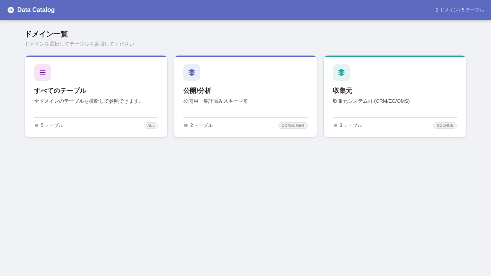
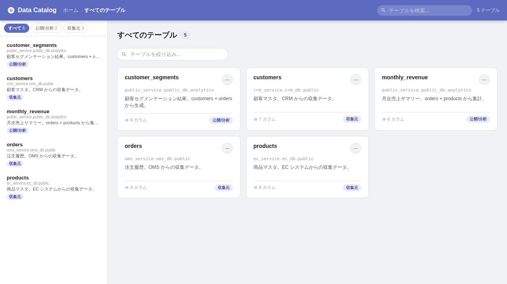
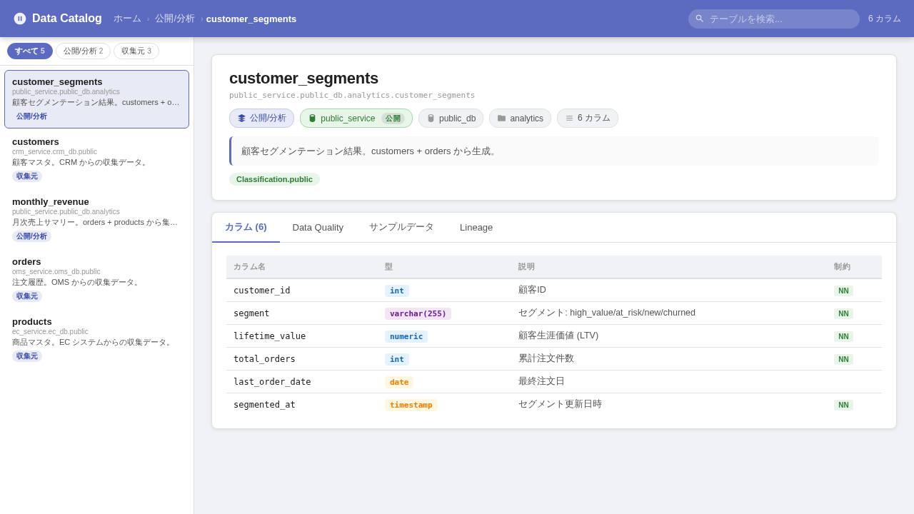
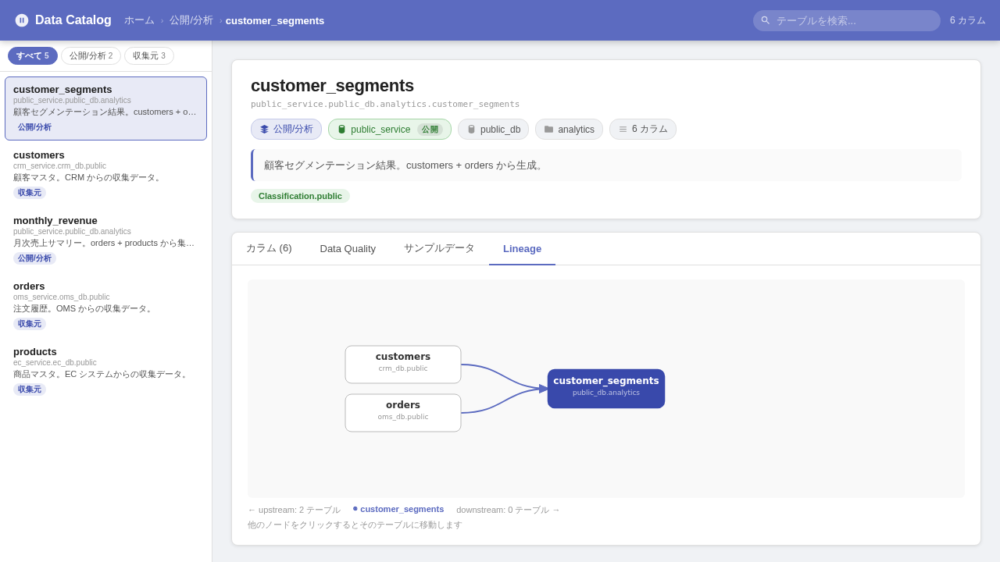

# OpenMetadata サンプル構成

設計方針 → [design.md](./design.md)

## 起動方法

### 前提条件

- Docker >= 20.10
- Docker Compose >= v2.2
- メモリ: **3GB 以上推奨**
- Python >= 3.11 (登録スクリプト実行用)
- Node.js >= 18 (Catalog UI 起動用)

### Step 1: バックエンド起動

```bash
docker compose up -d

# 起動確認 (応答が返るまで 2〜3 分待つ)
curl -s http://localhost:8585/api/v1/system/config/auth
```

### Step 2: メタデータ登録

`registrar` コンテナが自動で登録・定期更新するため、手動実行は不要。

登録状況の確認:

```bash
docker logs openmetadata_registrar
```

### Step 3: 動作確認

```bash
# サービス一覧
curl -s http://localhost:8585/api/v1/services/databaseServices?limit=10 | python3 -m json.tool | grep '"name"'

# テーブル一覧
curl -s 'http://localhost:8585/api/v1/tables?limit=10' | python3 -m json.tool | grep '"fullyQualifiedName"'

# DQ テストケース一覧
curl -s 'http://localhost:8585/api/v1/dataQuality/testCases?limit=10' | python3 -m json.tool | grep '"name"'
```

期待される出力:
- DatabaseService: `crm_service`, `ec_service`, `oms_service`, `public_service` の4件
- Table: `customers`, `products`, `orders`, `monthly_revenue`, `customer_segments` の5件
- TestCase: `customers_*`, `orders_*`, `products_*` の8件

### Step 4: Catalog UI 起動

```bash
cd catalog-ui
npm install
npm run dev
```

ブラウザで http://localhost:5173 を開く。

## ドキュメント更新

スクリーンショットは Playwright テストで自動生成しています。

```bash
cd catalog-ui
npm run test:screenshots   # docs/screenshots/ を更新
```

## UI デザイン
### ドメイン一覧 (ホーム)



### テーブル一覧



### テーブル詳細



### Lineage グラフ


