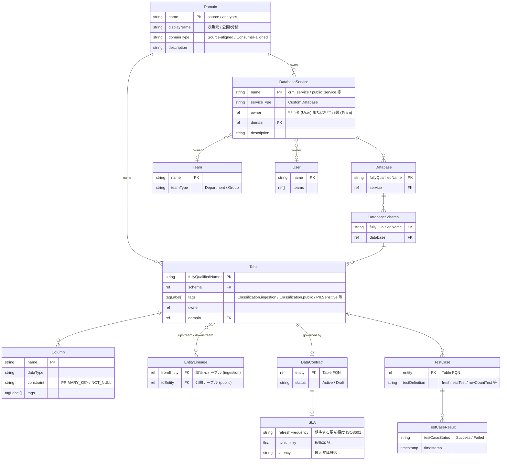

# Design: データ連携HUB × OpenMetadata マッピング設計

複数の収集元システムのスキーマを一元管理し、公開用スキーマとの対応関係を  
OpenMetadata のエンティティ構造にどうマッピングするかの設計方針を記述する。

---

## 概念モデル

データ連携HUBには3つの役割がある。

| 役割 | 概念 | OpenMetadata エンティティ |
|---|---|---|
| 収集元システム | 各業務システム (CRM / EC / OMS …) | `DatabaseService` (システムごとに1つ) |
| 公開スキーマ | 外部提供・集計済みテーブル群 | `DatabaseService` (public_service として1つ) |
| データフロー | 収集元 → 公開スキーマへの依存関係 | `EntityLineage` |

---

## DatabaseService によるシステム分離

収集元システムを **DatabaseService 単位で分離**することで、  
システム境界・担当者・SLA をサービスごとに独立して管理できる。

```
crm_service   (CRM System)
ec_service    (EC System)
oms_service   (Order Management System)
      ↓ Lineage
public_service (公開用スキーマ)
```

実 DB への接続は持たず、スキーマ定義のみを push する (`serviceType: CustomDatabase`)。

---

## エンティティ階層とマッピング



---

## メタデータ項目マッピング

| 管理したい情報 | エンティティ | フィールド | 備考 |
|---|---|---|---|
| 出所システム名・識別 | `DatabaseService` | `name` | システムごとに1サービス |
| 業務ドメイン分類 | `Domain` | `name` | `source`(収集元) / `analytics`(公開) |
| 担当者 | `DatabaseService` | `owner` (User) | |
| 担当部署 | `DatabaseService` | `owner` (Team) | User と Team は排他。Team 推奨 |
| 公開区分 | `Table` | `tags` | `Classification.public` / `Classification.ingestion` |
| 機密性 | `Table` / `Column` | `tags` | `PII.Sensitive` 等 |
| データフロー | `EntityLineage` | `fromEntity` → `toEntity` | 収集元テーブル → 公開テーブル |
| 期待する更新頻度 | `DataContract.sla` | `refreshFrequency` | SLA として宣言。例: `PT24H` |
| 稼働率 | `DataContract.sla` | `availability` | SLA として宣言。例: `99.9` |
| 鮮度チェック (実測) | `TestCase` + `TestCaseResult` | `freshnessTest` | 実績の pass/fail 時系列 |
| データ品質チェック | `TestCase` + `TestCaseResult` | 各 testDefinition | 行数・NULL・一意性 等 |
| サンプルデータ | `SampleData` | `rows` / `columns` | テーブルプレビュー用 |

> **稼働率・更新頻度は `DataContract.sla`** に持つ。  
> Custom Property は任意の拡張用途に残しておく。  
> 鮮度の「期待値」は DataContract、「実測値・合否」は TestCaseResult で分離する。

